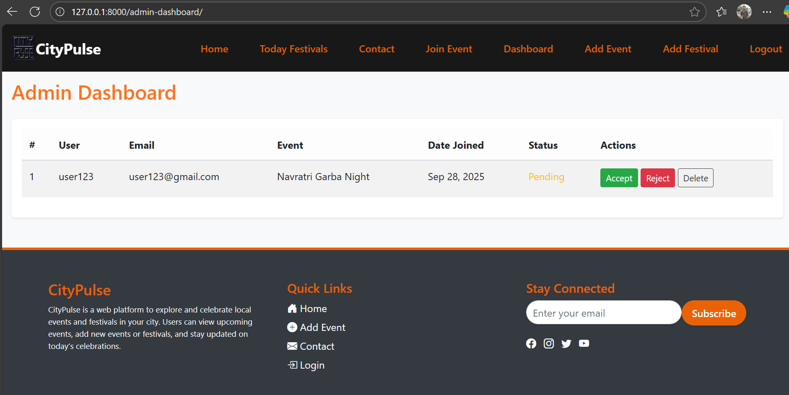
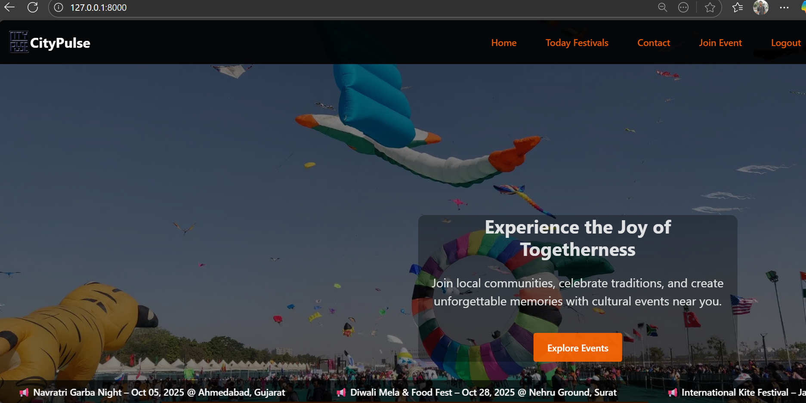
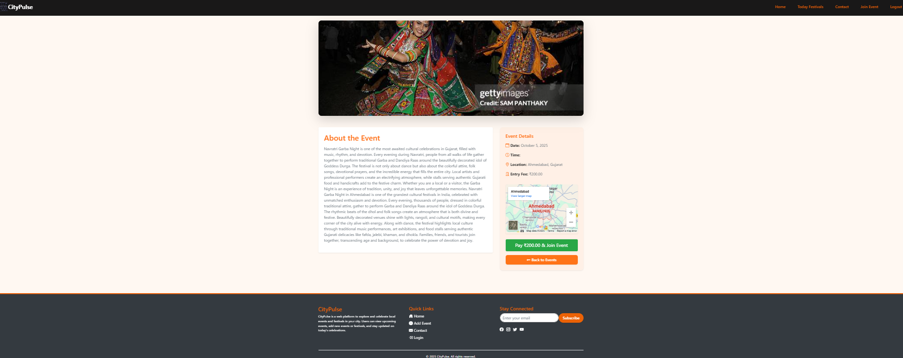
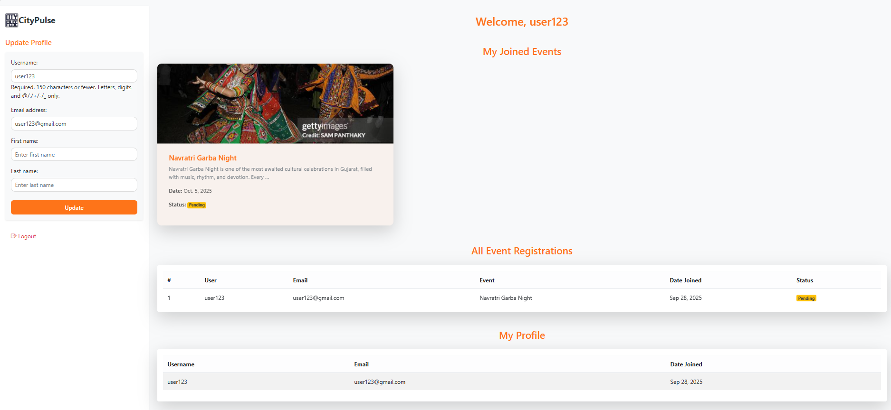

# LocaleventProject

A Django-based web app to manage and showcase **local events, festivals, and activities**. Users can view events, join them, and explore festivals happening in their city.

---

## Features

- List and browse local events and festivals  
- User registration and login  
- Join events (payment integration optional)  
- Admin dashboard to add/edit events and festivals  
- Responsive design (desktop & mobile)

---

## Screenshots

### Admin Page


### Home Page


### Event Details


### Join Event



---

## Installation

### Prerequisites

- Python 3.8+  
- Django 4+  
- pip (Python package manager)  

### Steps

1. **Clone the repository:**

```bash
git clone https://github.com/akash-panchal47/localeventproject-public.git
cd localeventproject-public
